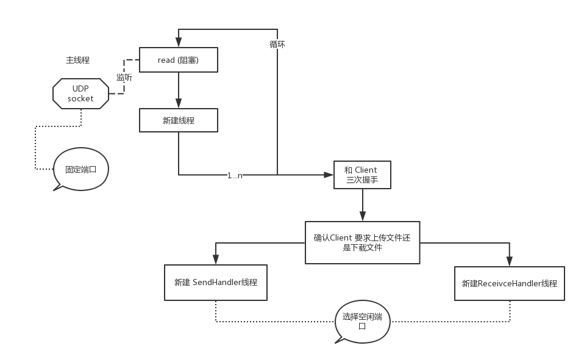
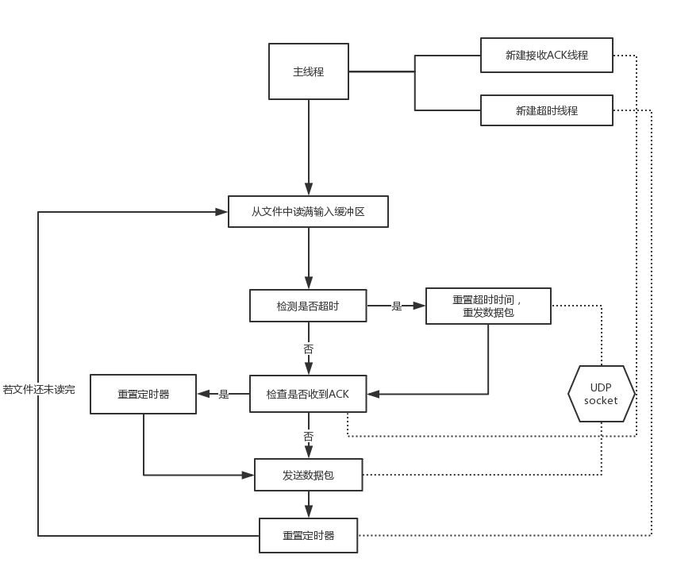
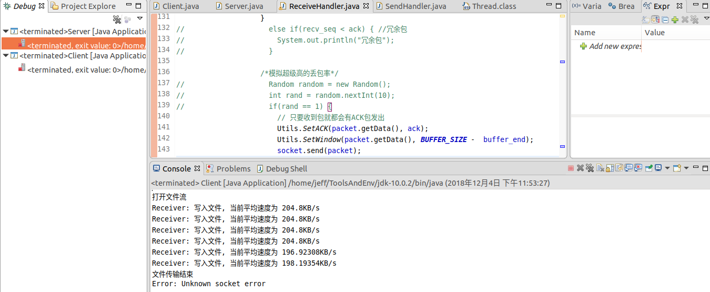
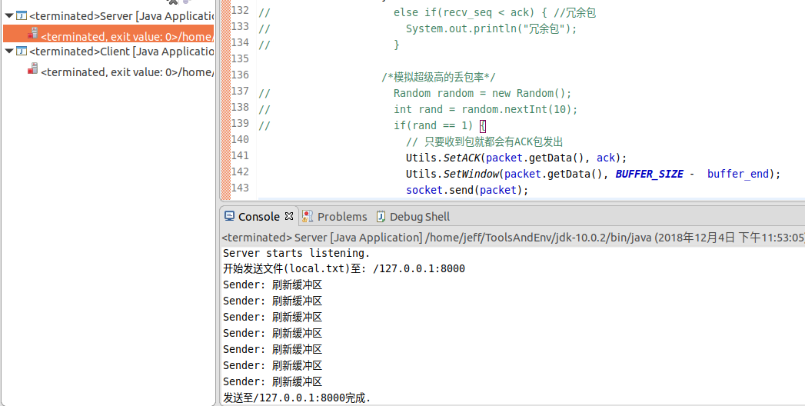

# LFTP

> 代码仓库可见于 https://github.com/zys980808/tcp_by_udp 
> **移步仓库查看最新版**

LFTP协议是使用UDP套接字实现的大文件可靠传输协议，它属于应用层协议。该协议在本项目中绑定到一个CS架构的文件传输应用当中。最终的项目源码见于 `LFTP/src` 文件夹中。

## 应用架构

由于应用需实现一对多、双向的C-S架构，因此简单的套接字模型无法满足现有需求，需要对应用架构进行新的设计。另外，在建立起Client-Server的单条连接以后，双方就不再是 "Client-Server" 的关系了，取而代之的是 "Sender-Receiver" 的关系，而且原 CS 对象 和新的 SR 对象并不一定是对应关系。因此在 CS架构下完成双方握手以后，数据的传输由 `SendHandler` 与 `ReceiveHandler` 托管执行。

**Server**

服务端常开一个固定端口的UDP socket对到来的Client请求进行轮询处理。对于每个到来的Client Request，Server会分配一个新的线程进行处理，进行三次握手的过程。三次握手的期间，服务端新开的线程会为该Client新建一个Socket，并且将这个Socket的端口在第二次握手的过程中发给客户端。

**Client**

客户端比较简单，在主线程寻找合适端口后新建Socket与服务端进行握手（注意中间目的端口会产生变化）；而后新建对应的Handler线程对下载/上传进行对应处理。

> 比较难实现的是两个Handler - SendHandler负责发送，ReceiveHandler负责接收

**SendHandler**

发送端在主线程进行发送数据包、检查超时并重发、检查ACK并重置；主线程会新建两个线程：使用Socket接收ACK的线程和使用定时器检测ACK超时的线程，两者的交互由主线程来实现。事实上，下图并不完全准确，在“发送数据包”的过程其实还有一层循环，因为一个缓冲区的数据不是一次性发送完的，而是以最多MSS的报文逐个传输出去。

**ReceiveHandler**

在接收数据端处理器中，到达Socket的数据和写文件的FileIO形成了`生产者与消费者`模型，而本应用在实现过程中将 接收Socket数据 和 写文件操作 分成了两个线程，因此**线程同步**是这个部分的最大难点。

事实上，本应用并没有在逻辑上实现加锁解锁，而是同SendHandler一样，借由主线程作为中间量，更新两个线程的变量达到交互作用。下图的缓冲区中，读Socket的线程只需要修改 buffer_end, 而File线程只需要在写入文件以后修改 buffer_start, 因此两者的操作是**线程安全**的。

## Header定义

## 可靠传输

## 流量控制

## 阻塞控制

# 应用测试与截图

## 单用户正常文件下载

**Client指令**

**Client运行结果**

**Server运行结果**

## 多用户文件下载

## 上传下载同步

## 链路错误模拟

# 项目感想

